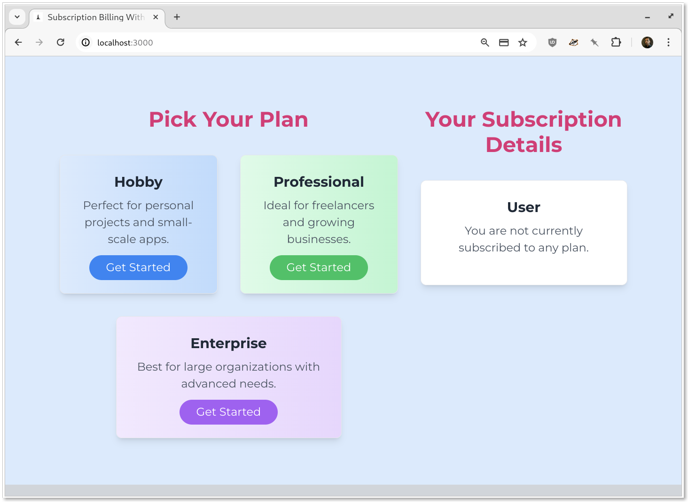

# rails-pay-checkout-demo

Stripe integration with Rails and the Pay gem for Subscription Billing.



## Table of Contents
- [Stripe Checkout](#stripe-checkout)
  - [The sequence of events for Stripe Checkout are](#the-sequence-of-events-for-stripe-checkout-are)
  - [Products and Prices](#products-and-prices)
- [The Pay Integration](#the-pay-integration)
  - [Set up your payment processor credentials and initializers](#set-up-your-payment-processor-credentials-and-initializers)
    - [Stripe Credentials](#stripe-credentials)
    - [Initializers](#initializers)
  - [Add the `pay_customer` Class Method to the User Model](#add-the-pay_customer-class-method-to-the-user-model)
  - [Request a Checkout URL and Redirect the User](#request-a-checkout-url-and-redirect-the-user)
    - [Checkout URL Generator](#checkout-url-generator)
  - [Handle Stripe Events](#handle-stripe-events)
    - [Stripe CLI](#stripe-cli)
    - [The Payment Succeed Event](#the-payment-succeed-event)
- [Appendix](#appendix)
  - [Relevant Files](#relevant-files)
- [Related Articles](#related-articles)

## Stripe Checkout
**Stripe Checkout** Stripe Checkout is a checkout flow where Stripe hosts the payments page that collects the credit card details.

### The sequence of events for Stripe Checkout are:
1. A checkout session is created.
1. The user is redirected to Stripe's payment page.
1. The user completed a payment on Stripe's page.
1. The user is redirected back to the app.
1. The app receives a "payment success" webhook from Stripe.

### Products and Prices
[Products](https://dashboard.stripe.com/products) and prices are used manage subscription billing. In this app, each plan is its own product, and each product has a single [price](app/controllers/checkouts_controller.rb).


## The Pay Integration
To complete the integration

1. Set up your payment processor credentials and [initializers](#initializers).
1. Add the `pay_customer` the [User](#pay_customer) Model.
1. Request a Checkout URL and [Redirect](#redirect) the User
1. Handle Stripe [Events](#events)

### Set up your payment processor credentials and initializers  {#initializers}
#### Stripe Credentials
Follow Pay's [configuration instructions](https://github.com/pay-rails/pay/blob/main/docs/2_configuration.md#configuring-pay) to set up your Stripe credentials.

#### Initializers
1. Create or update the [stripe.rb](config/initializers/stripe.rb) initializer.
1. Create the [pay.rb](config/initializers/pay.rb) initializer.

### Add the `pay_customer` Class Method to the User Model

1. **Generate the Pay Models**:
   - Pay is already installed. For a fresh app, run `bin/rails pay:install:migrations` to create the necessary Pay models.

2. **Update the User Model**:
   - Add `pay_customer` to the User model:
     ```ruby
     class User < ApplicationRecord
       pay_customer
     end
     ```

Including `pay_customer` in the User model establishes an internal association between the User and the `Pay::Customer` model. This association uses the `owner_type` and `owner_id` fields.

`payment_processor` is the entry point to Pay's functionality. By including pay_customer in the User model, the payment_processor method becomes available on all User instances, providing access to customer, subscription, and charge models.


### Request a Checkout URL and Redirect the User
Using Pay, request a checkout URL from Stripe and then redirect the user to that URL. Once the transaction is complete, Stripe will return the user to the URL defined by `success_URL`, along with a `session_id`.

#### Checkout URL Generator
```ruby
def checkout
  user.payment_processor.checkout(
    mode: "subscription",
    line_items: stripe_price_id,
    success_url: success_url,
    billing_address_collection: "auto",
    allow_promotion_codes: false,
  )
end
```

### Handle Stripe Events
#### Stripe CLI
The Pay Gem requires Stripe Webhooks to function properly. When building the Pay integration locally, you'll need to set up the [Stripe CLI](https://docs.stripe.com/stripe-cli) and have it running to forward the events to your app.

```bash
$ stripe listen --forward-to localhost:3000/pay/webhooks/stripe
```

Update your stripe credentials to include the webhook signing secreted generated by the CLI.


#### The Payment Succeed Event
When Stripe processes a payment successfully, it triggers the invoice.payment_succeeded [event] (https://github.com/pay-rails/pay/tree/main/test/pay/stripe/webhooks). Use this event to initiate other workflows in Rails. For instance, access a paid feature or a custom receipt.

```ruby
class PaymentSucceededHandler
  def call(event)
    pay_charge = Pay::Stripe::Charge.sync(
      event.data.object.charge,
      stripe_account: event.try(:account)
    )
    return if pay_charge.nil?

    adjust_user(pay_charge)
  end

  def adjust_user(pay_charge)
    user = pay_charge.customer.owner
    user.update!(updated_at: Time.zone.now)
  end
end
```

## Appendix

### Relevant Files
1. [user.rb](app/models/user.rb)
1. [app/controllers/static_controller.rb](app/controllers/static_controller.rb)
1. [app/controllers/checkouts_controller.rb](app/controllers/checkouts_controller.rb?#L23)
1. [config/environments/development.rb](config/environments/development.rb?#L78)
1. [app/services/stripe_checkout.rb](app/services/stripe_checkout.rb)
1. [app/services/payment_succeded_handler.rb](app/services/payment_succeded_handler.rb)
1. [config/initializers/pay.rb](config/initializers/pay.rb)
1. [config/initializers/stripe.rb](config/initializers/stripe.rb)

### Related Articles
1. [Stripe Checkout](https://github.com/pay-rails/pay/blob/main/docs/stripe/8_stripe_checkout.md)
1. [Routes and Webhooks](https://github.com/pay-rails/pay/blob/main/docs/7_webhooks.md)
1. [Stripe Webhooks](https://github.com/pay-rails/pay/blob/main/docs/stripe/5_webhooks.md)
